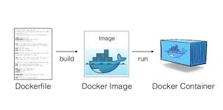

# Docker



## Create docker image with docker file
```
#download based image from dockerhub.com
FROM python:3.12-slim

#create a new folder in linux image
WORKDIR /app

#copy from based-operating-system to linux image
#copy fist dot represent source second dot represent destination 
#copy everything from source-operating-system to linux image
COPY . ./app 

#run python file code
CMD python ./app/my_code.py 

```

`docker build -t <my-dev-image> .` <br>
if you want to create image with any specific env lke dev, test, opt then use below command <br>
`docker build -f Dockerfile.dev -t my-dev-image .`
