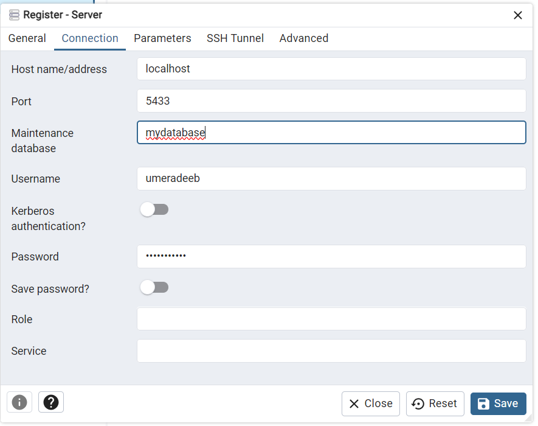
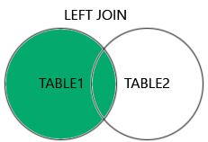
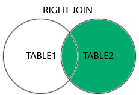
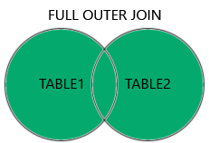

`docker-compose up --build`
```
environment:                  
- POSTGRES_USER=umeradeeb
- POSTGRES_PASSWORD=my_password
- POSTGRES_DB=mydatabase
ports:
- '5433:5432' 
```
     * **5433**




https://chatgpt.com/share/4c03b4b0-3594-4b8e-b2be-3869c1777131


----------------
# SQL queries


### q1
```sql
SELECT
	student_id,
	student_name,
	teacher_id
FROM 
    students;
```
### q2
```sql
SELECT
	teacher_id,
	student_name,
	student_name,
	student_name,
	student_id
	
FROM 
    students;
```

### q3
```sql
SELECT
	subject,
	teacher_name
	
FROM 
	teachers;
```

### q4
```sql
SELECT
	student_name,
	teacher_name
FROM
	students,
	teachers;
```

### q5 cross join (wrong way)
```sql
SELECT
	students.student_id,
	students.student_name,
	teachers.teacher_id,
	teachers.teacher_name
FROM
	students,
	teachers;
```

### q6 Inner join
```sql
SELECT
	students.student_id,
	students.student_name,
	teachers.teacher_id,
	teachers.teacher_name
	
FROM 
	students,
	teachers
WHERE
	students.teacher_id = teachers.teacher_id;
```

### q7 Select two columns from each table
```sql
SELECT
	s.student_id,
    s.student_name,
    f.fee_amount,
    f.fee_paid_date,
    t.teacher_name
	
FROM 
	students s inner join teachers t on s.teacher_id = t.teacher_id
    students st inner join fees f on st.student_id = f.student_id;
```


### Example
```python
l1 : [int] = [1,2,3,4,5,6,7]
l2 : [int] = [3,5,20,100]

#output
[3,5]
```




### q8 (same q7 using WHERE)
```sql
SELECT
	students.student_id,
	students.student_name,
	fees.fee_amount,
	fees.fee_paid_date,
	teachers.teacher_name
	
	
FROM 
	students,
	teachers,
	fees
WHERE
	students.teacher_id = teachers.teacher_id AND 
	students.student_id = fees.student_id;
```

# Dated: 23 Aug 2024

### Actual query
```sql
SELECT COUNT(DISTINCT city) FROM Customers;
```

### Alternate Query (Query within a query)
```sql
SELECT COUNT(*) FROM (SELECT DISTINCT City FROM Customers);
```

### BETWEEN (Between a certain range)
```sql
SELECT * FROM Customer
WHERE CustomerID BETWEEN 10 AND 20;
```

### IN (To specify multiple possible values for a column)
```sql
SELECT * FROM Customer
WHERE CustomerID IN (1,3,20,50);
```

```sql
SELECT * FROM Customer
Where Country='Germany' OR Country='UK";
```

#Alternate Query
```sql
SELECT * FROM Customer
Where Country IN ('Germany', 'UK');
```
### LIKE (Search for a pattern like Regex)
```sql
SELECT * FROM Customer
Where City LIKE %san%;
```

### ORDER BY
```sql
SELECT * FROM Products
ORDER BY Price DESC;
```

### INSERT 
```sql
SELECT * FROM students
INSERT INTO students (student_id, student_name, teacher_id)
VALUES (11, 'Umer Adeeb', 1)

INSERT INTO students
VALUES (12, 'Amna Younus', 2)
```

### INSERT multiple data
```sql
INSERT INTO students(student_id, student_name, teacher_id)
VALUES 
(13, 'Ammarah Affan', 1),
(14, 'Abeeha', 3),
(15, 'Muhammad Usman', 2)
```

### NULL
```sql
SELECT * FROM students
WHERE student_name IS NULL
```

### UPDATE
```sql
UPDATE students
SET
student_name = 'Iqra'
WHERE student_id = 16
```

### DELETE
```sql
DELETE FROM students
WHERE student_id = 16
```

### Create new table for deleting data and table person
```sql
-- Creating the teachers table
CREATE TABLE staff (
    staff_id SERIAL PRIMARY KEY,
    staff_name VARCHAR(100),
    salary VARCHAR(50)
);

INSERT INTO STAFF
VALUES (1, 'Ali', 200000), (2, 'Hamza', 300000)

SELECT * FROM staff
```

### DELETE
```sql
DELETE FROM staff
```

### DROP TABLE (Deleting whole table structure)
```sql
DROP TABLE staff
```

### LIMIT (it will pick top 5 rows)
```sql
SELECT * FROM students
WHERE teacher_id = 1
LIMIT 5
```

### AGGREGATE FUNCTIONS
```sql
SELECT * FROM fees
SELECT MAX(fee_amount) FROM fees
SELECT MIN(fee_amount) FROM fees

SELECT MAX(fee_paid_date) FROM fees
SELECT MIN(fee_paid_date) FROM fees

SELECT AVG(fee_amount) FROM fees
SELECT SUM(fee_amount) FROM fees
```

### GROUP BY
```sql
SELECT * FROM students
SELECT MIN(student_id), teacher_id from students
Group by teacher_id
```

### COUNT
```sql
SELECT COUNT(student_id), teacher_id from students
Group by teacher_id

Select * from students
select count(distinct teacher_id) from students

select count(distinct teacher_id) as "uni teachers" from students
```

### GROUP
```sql
SELECT * FROM (SELECT ProductID, SUM(Quantity) AS [Total product orders]
              FROM OrderDetails
              GROUP BY ProductID)
ORDER BY [Total product orders] DESC
```

### JOINING AND SUM
```sql
SELECT  teacher_id, SUM(fee_amount) 
FROM students
LEFT JOIN fees ON students.student_id = fees.student_id
group by teacher_id;
```

```sql
SELECT * FROM Customers
WHERE CustomerID NOT IN (SELECT CustomerID FROM Orders);
```

### BETWEEN WITH DATE
```sql
SELECT * from fees
where 
fee_paid_date BETWEEN '2024-01-01' AND '2024-12-31'
```

### ALIAS
```sql
select 
	student_id as "Roll No",
	student_name as "Name"
from students
```

### INNER JOIN STUDENTS WITH TEACHERS AND STUDENTS WITH FEES
```sql
select * from students
select * from teachers
select * from fees

select * from students s
inner join teachers t on s.teacher_id = t.teacher_id

select * from students s
inner join fees f on s.student_id = f.student_id
```

### JOINING THREE TABLES
```sql
select * from students s
inner join fees f on s.student_id = f.student_id
inner join teachers t on s.teacher_id = t.teacher_id
```


